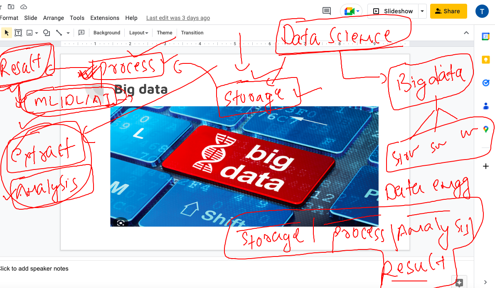

### getting started

### data science & engineering 



### Understanding bigdata as a problem and hadoop as a solution 


### Hadoop HDFS architecture 


### Introduction to HDFS 


### More info about HDFS 


## setup hadoop client 

### jdk 8 

```
root@ip-172-31-1-160:~# apt install openjdk-8-jdk 
Reading package lists... Done
Building dependency tree... Done
Reading state information... Done
The following additional packages will be installed:
  adwaita-icon-theme alsa-topology-conf alsa-ucm-conf at-spi2-core ca-certificates-java dconf-gsettings-backend
  dconf-service fontconfig
```

### verify java installation 

```
ashu@ip-172-31-1-160:~$ java -version 
openjdk version "1.8.0_362"
OpenJDK Runtime Environment (build 1.8.0_362-8u362-ga-0ubuntu1~22.04-b09)
OpenJDK 64-Bit Server VM (build 25.362-b09, mixed mode)
ashu@ip-172-31-1-160:~$ 
```

### setting permanent path 

```
ashu@ip-172-31-1-160:~$ vim  ~/.bashrc 
JAVA_HOME=JAVA_HOME=/usr/lib/jvm/java-8-openjdk-amd64
PATH=$PATH:$JAVA_HOME/bin
export PATH
```

### loading .bashrc file

```
ashu@ip-172-31-1-160:~$ source ~/.bashrc 
ashu@ip-172-31-1-160:~$ 
ashu@ip-172-31-1-160:~$ echo $PATH
/usr/local/sbin:/usr/local/bin:/usr/sbin:/usr/bin:/sbin:/bin:/usr/games:/usr/local/games:/snap/bin:/usr/lib/jvm/java-8-openjdk-amd64/bin
ashu@ip-172-31-1-160:~$ jps
6381 Jps

```


