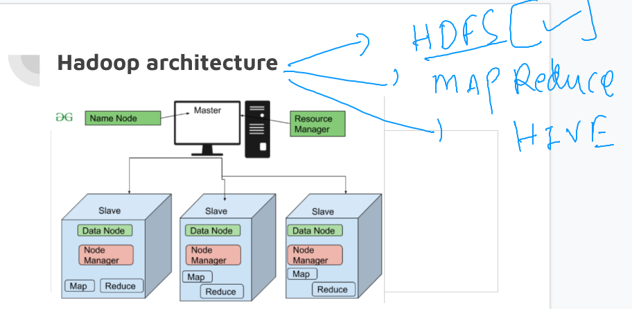

### getting started

### data science & engineering 


### Understanding bigdata as a problem and hadoop as a solution 


### Hadoop HDFS architecture 



### Introduction to HDFS 


### More info about HDFS 


## setup hadoop client 

### jdk 8 

```
root@ip-172-31-1-160:~# apt install openjdk-8-jdk 
Reading package lists... Done
Building dependency tree... Done
Reading state information... Done
The following additional packages will be installed:
  adwaita-icon-theme alsa-topology-conf alsa-ucm-conf at-spi2-core ca-certificates-java dconf-gsettings-backend
  dconf-service fontconfig
```

### verify java installation 

```
ashu@ip-172-31-1-160:~$ java -version 
openjdk version "1.8.0_362"
OpenJDK Runtime Environment (build 1.8.0_362-8u362-ga-0ubuntu1~22.04-b09)
OpenJDK 64-Bit Server VM (build 25.362-b09, mixed mode)
ashu@ip-172-31-1-160:~$ 
```

### setting permanent path 

```
ashu@ip-172-31-1-160:~$ vim  ~/.bashrc 
JAVA_HOME=JAVA_HOME=/usr/lib/jvm/java-8-openjdk-amd64
PATH=$PATH:$JAVA_HOME/bin
export PATH
```

### loading .bashrc file

```
ashu@ip-172-31-1-160:~$ source ~/.bashrc 
ashu@ip-172-31-1-160:~$ 
ashu@ip-172-31-1-160:~$ echo $PATH
/usr/local/sbin:/usr/local/bin:/usr/sbin:/usr/bin:/sbin:/bin:/usr/games:/usr/local/games:/snap/bin:/usr/lib/jvm/java-8-openjdk-amd64/bin
ashu@ip-172-31-1-160:~$ jps
6381 Jps

```

### Downloading and setting up apache hadoop software 

```
 wget https://downloads.apache.org/hadoop/common/hadoop-3.2.3/hadoop-3.2.3.tar.gz
 ashu@ip-172-31-1-160:~$ ls
hadoop-3.2.3.tar.gz
ashu@ip-172-31-1-160:~$ tar xvzf hadoop-3.2.3.tar.gz 
hadoop-3.2.3/
hadoop-3.2.3/NOTICE.txt
hadoop-3.2.3/sbin/
hadoop-3.2.3/sbin/start-yarn.cmd
hadoop-3.2.3/sbin
```

### setting up hadoop home env 

```
ashu@ip-172-31-1-160:~$ ls
hadoop-3.2.3  hadoop-3.2.3.tar.gz
ashu@ip-172-31-1-160:~$ 
ashu@ip-172-31-1-160:~$ cd hadoop-3.2.3/
ashu@ip-172-31-1-160:~/hadoop-3.2.3$ ls
LICENSE.txt  NOTICE.txt  README.txt  bin  etc  include  lib  libexec  sbin  share
ashu@ip-172-31-1-160:~/hadoop-3.2.3$ pwd
/home/ashu/hadoop-3.2.3
ashu@ip-172-31-1-160:~/hadoop-3.2.3$ cd
ashu@ip-172-31-1-160:~$ 
ashu@ip-172-31-1-160:~$ vim  ~/.bashrc 
ashu@ip-172-31-1-160:~$ tail -7  ~/.bashrc 
fi

JAVA_HOME=/usr/lib/jvm/java-8-openjdk-amd64
HADOOP_HOME=/home/ashu/hadoop-3.2.3
PATH=$PATH:$JAVA_HOME/bin:$HADOOP_HOME/bin:$HADOOP_HOME/sbin
export PATH

ashu@ip-172-31-1-160:~
```

### verify hdfs command 

```
ashu@ip-172-31-1-160:~$ source ~/.bashrc 
ashu@ip-172-31-1-160:~$ 
ashu@ip-172-31-1-160:~$ hdfs 
Usage: hdfs [OPTIONS] SUBCOMMAND [SUBCOMMAND OPTIONS]

  OPTIONS is none or any of:

--buildpaths                       attempt to add class files from build tree
--config dir                       Hadoop config directory
--daemon (start|status|stop)       operate on a daemon
--debug                
```

### update core-site-xml for namenode connection string 

```
ashu@ip-172-31-1-160:~$ ls
hadoop-3.2.3  hadoop-3.2.3.tar.gz
ashu@ip-172-31-1-160:~$ cd hadoop-3.2.3/
ashu@ip-172-31-1-160:~/hadoop-3.2.3$ ls
LICENSE.txt  NOTICE.txt  README.txt  bin  etc  include  lib  libexec  sbin  share
ashu@ip-172-31-1-160:~/hadoop-3.2.3$ cd  etc/
ashu@ip-172-31-1-160:~/hadoop-3.2.3/etc$ ls
hadoop
ashu@ip-172-31-1-160:~/hadoop-3.2.3/etc$ cd hadoop/
ashu@ip-172-31-1-160:~/hadoop-3.2.3/etc/hadoop$ ls
capacity-scheduler.xml      hadoop-user-functions.sh.example  kms-log4j.properties        ssl-client.xml.example
configuration.xsl           hdfs-site.xml                     kms-site.xml                ssl-server.xml.example
container-executor.cfg      httpfs-env.sh                     log4j.properties            user_ec_policies.xml.template
core-site.xml               httpfs-log4j.properties           mapred-env.cmd              workers
hadoop-env.cmd              httpfs-signature.secret           mapred-env.sh               yarn-env.cmd
hadoop-env.sh               httpfs-site.xml                   mapred-queues.xml.template  yarn-env.sh
hadoop-metrics2.properties  kms-acls.xml                      mapred-site.xml             yarn-site.xml
hadoop-policy.xml           kms-env.sh                        shellprofile.d              yarnservice-log4j.properties
ashu@ip-172-31-1-160:~/hadoop-3.2.3/etc/hadoop$ vim core-site.xml 
ashu@ip-172-31-1-160:~/hadoop-3.2.3/etc/hadoop$ cat core-site.xml 
<?xml version="1.0" encoding="UTF-8"?>
<?xml-stylesheet type="text/xsl" href="configuration.xsl"?>
<!--
  Licensed under the Apache License, Version 2.0 (the "License");
  you may not use this file except in compliance with the License.
  You may obtain a copy of the License at

    http://www.apache.org/licenses/LICENSE-2.0

  Unless required by applicable law or agreed to in writing, software
  distributed under the License is distributed on an "AS IS" BASIS,
  WITHOUT WARRANTIES OR CONDITIONS OF ANY KIND, either express or implied.
  See the License for the specific language governing permissions and
  limitations under the License. See accompanying LICENSE file.
-->

<!-- Put site-specific property overrides in this file. -->

<configuration>
<property>
<name>fs.defaultFS</name>
<value>hdfs://ec2-13-127-64-190.ap-south-1.compute.amazonaws.com:9000</value>
</property>
</configuration>

```

### export java_home in hadoop-env.sh

```
ashu@ip-172-31-1-160:~/hadoop-3.2.3/etc/hadoop$ ls
capacity-scheduler.xml      hadoop-user-functions.sh.example  kms-log4j.properties        ssl-client.xml.example
configuration.xsl           hdfs-site.xml                     kms-site.xml                ssl-server.xml.example
container-executor.cfg      httpfs-env.sh                     log4j.properties            user_ec_policies.xml.template
core-site.xml               httpfs-log4j.properties           mapred-env.cmd              workers
hadoop-env.cmd              httpfs-signature.secret           mapred-env.sh               yarn-env.cmd
hadoop-env.sh               httpfs-site.xml                   mapred-queues.xml.template  yarn-env.sh
hadoop-metrics2.properties  kms-acls.xml                      mapred-site.xml             yarn-site.xml
hadoop-policy.xml           kms-env.sh                        shellprofile.d              yarnservice-log4j.properties
ashu@ip-172-31-1-160:~/hadoop-3.2.3/etc/hadoop$ echo $JAVA_HOME
/usr/lib/jvm/java-8-openjdk-amd64
ashu@ip-172-31-1-160:~/hadoop-3.2.3/etc/hadoop$ vim hadoop-env.sh 
ashu@ip-172-31-1-160:~/hadoop-3.2.3/etc/hadoop$ vim hadoop-env.sh  +54
ashu@ip-172-31-1-160:~/hadoop-3.2.3/etc/hadoop$ vim hadoop-env.sh  +54
ashu@ip-172-31-1-160:~/hadoop-3.2.3/etc/hadoop$ vim hadoop-env.sh  +54
ashu@ip-172-31-1-160:~/hadoop-3.2.3/etc/hadoop$ vim hadoop-env.sh  +54
ashu@ip-172-31-1-160:~/hadoop-3.2.3/etc/hadoop$ vim hadoop-env.sh  +54
ashu@ip-172-31-1-160:~/hadoop-3.2.3/etc/hadoop$ 
```

### hadoop super user can do all / file-system access

```
ashu@ip-172-31-1-160:~$ hdfs  dfs  -ls  /
Found 2 items
drwxr-xr-x   - ubuntu supergroup          0 2023-03-13 07:25 /data-only
drwxr-xr-x   - ubuntu supergroup          0 2023-03-10 06:24 /test
ashu@ip-172-31-1-160:~$ ls /home
akanksha  amritendu  ashu  giridhar  krishna  siva  srihari  ubuntu  uday
ashu@ip-172-31-1-160:~$ hdfs  dfs  -ls  /data-only 
Found 4 items
drwxr-xr-x   - akanksha  supergroup          0 2023-03-13 07:27 /data-only/akanksha
drwxr-xr-x   - amritendu supergroup          0 2023-03-13 07:27 /data-only/amritendu
drwxr-xr-x   - ashu      supergroup          0 2023-03-13 07:27 /data-only/ashu
drwxr-xr-x   - giridhar  supergroup          0 2023-03-13 07:27 /data-only/giridhar
ashu@ip-172-31-1-160:~$ hdfs  dfs  -ls  /data-only 
Found 9 items
drwxr-xr-x   - akanksha  supergroup          0 2023-03-13 07:27 /data-only/akanksha
drwxr-xr-x   - amritendu supergroup          0 2023-03-13 07:27 /data-only/amritendu
drwxr-xr-x   - ashu      supergroup          0 2023-03-13 07:27 /data-only/ashu
drwxr-xr-x   - giridhar  supergroup          0 2023-03-13 07:27 /data-only/giridhar
drwxr-xr-x   - krishna   supergroup          0 2023-03-13 07:27 /data-only/krishna
drwxr-xr-x   - siva      supergroup          0 2023-03-13 07:27 /data-only/siva
drwxr-xr-x   - srihari   supergroup          0 2023-03-13 07:27 /data-only/srihari
drwxr-xr-x   - ubuntu    supergroup          0 2023-03-13 07:28 /data-only/ubuntu
drwxr-xr-x   - uday      supergroup          0 2023-03-13 07:28 /data-only/uday
ashu@ip-172-31-1-160:~$ 
ashu@ip-172-31-1-160:~$ 
ashu@ip-172-31-1-160:~$ whoami
ashu
ashu@ip-172-31-1-160:~$ hdfs  dfs -mkdir  /data-only/ashu/textdata
ashu@ip-172-31-1-160:~$ 
ashu@ip-172-31-1-160:~$ hdfs  dfs -mkdir  /data-only/siva/textdata
mkdir: Permission denied: user=ashu, access=WRITE, inode="/data-only/siva":siva:supergroup:drwxr-xr-x
ashu@ip-172-31-1-160:~$ 

```


