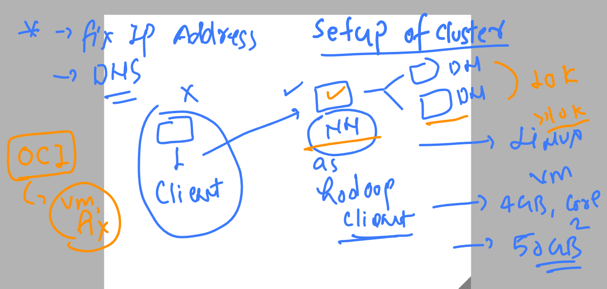
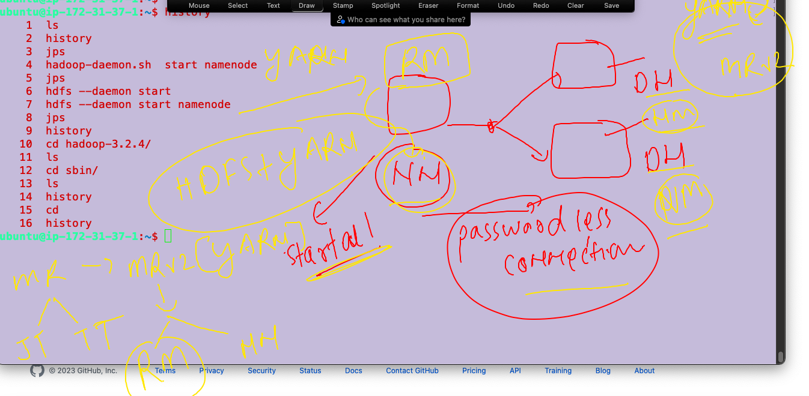

## hadoop by apache foundation -- hadoop v2 / hadoop v3 

### setup of hadoop v3 / v2 -- multinode cluster -- 1 namenode , 2 datanode 



### creating 3 vms of oracle linux / redhat linux / amazon linux / ubuntu 20 or later 
### i am using ubuntu linux 22 

## common steps to all the vm 

### checking os version 
```
ubuntu@ip-172-31-37-1:~$ cat /etc/os-release 
PRETTY_NAME="Ubuntu 22.04.1 LTS"
NAME="Ubuntu"
VERSION_ID="22.04"
VERSION="22.04.1 LTS (Jammy Jellyfish)"
VERSION_CODENAME=jammy
ID=ubuntu
ID_LIKE=debian
HOME_URL="https://www.ubuntu.com/"
SUPPORT_URL="https://help.ubuntu.com/"
BUG_REPORT_URL="https://bugs.launchpad.net/ubuntu/"
PRIVACY_POLICY_URL="https://www.ubuntu.com/legal/terms-and-policies/privacy-policy"
UBUNTU_CODENAME=jammy

```

### update apt repo 

```
ubuntu@ip-172-31-37-1:~$ sudo apt update 
Hit:1 http://ap-south-1.ec2.archive.ubuntu.com/ubuntu jammy InRelease
Get:2 http://ap-south-1.ec2.archive.ubuntu.com/ubuntu jammy-updates InRelease [119 kB]
Get:3 http://security.ubuntu.com/ubuntu jammy-security InRelease [110 kB]             

```

### Installing jdk8 & setup path of java 

```
ubuntu@ip-172-31-37-1:~$ sudo apt install openjdk-8-jdk 
Reading package lists... Done
Building dependency tree... Done
Reading state information... Done
The following additional packages will be installed:
  adwaita-icon-theme alsa-topology-conf alsa-ucm-conf at-spi2-core ca-certificates-java dconf-gsettings-backend
  dconf-service fontconfig fontconfig-config fonts-d
  
  =========>checking java version 
  
  
  ubuntu@ip-172-31-37-1:~$ java -version 
openjdk version "1.8.0_362"
OpenJDK Runtime Environment (build 1.8.0_362-8u362-ga-0ubuntu1~22.04-b09)
OpenJDK 64-Bit Server VM (build 25.362-b09, mixed mode)
ubuntu@ip-172-31-37-1:~$ 

===============> setup java path 

ubuntu@ip-172-31-37-1:~$ cd  /usr/lib/jvm/
ubuntu@ip-172-31-37-1:/usr/lib/jvm$ ls
java-1.8.0-openjdk-amd64  java-8-openjdk-amd64
ubuntu@ip-172-31-37-1:/usr/lib/jvm$ cd java-8-openjdk-amd64/
ubuntu@ip-172-31-37-1:/usr/lib/jvm/java-8-openjdk-amd64$ ls
ASSEMBLY_EXCEPTION  THIRD_PARTY_README  bin  docs  include  jre  lib  man  src.zip
ubuntu@ip-172-31-37-1:/usr/lib/jvm/java-8-openjdk-amd64$ pwd
/usr/lib/jvm/java-8-openjdk-amd64
ubuntu@ip-172-31-37-1:/usr/lib/jvm/java-8-openjdk-amd64$ vim  ~/.bashrc 
ubuntu@ip-172-31-37-1:/usr/lib/jvm/java-8-openjdk-amd64$ tail -4  ~/.bashrc 

export JAVA_HOME=/usr/lib/jvm/java-8-openjdk-amd64
PATH=$PATH:$JAVA_HOME/bin
export PATH
ubuntu@ip-172-31-37-1:/usr/lib/jvm/java-8-openjdk-amd64$ source ~/.bashrc 
ubuntu@ip-172-31-37-1:/usr/lib/jvm/java-8-openjdk-amd64$ 
ubuntu@ip-172-31-37-1:/usr/lib/jvm/java-8-openjdk-amd64$ echo $JAVA_HOME
/usr/lib/jvm/java-8-openjdk-amd64


```

### Download apache hadoop tar 

```

ubuntu@ip-172-31-37-1:~$ wget https://downloads.apache.org/hadoop/common/hadoop-3.2.4/hadoop-3.2.4.tar.gz
--2023-03-14 05:02:01--  https://downloads.apache.org/hadoop/common/hadoop-3.2.4/hadoop-3.2.4.tar.gz
Resolving downloads.apache.org (downloads.apache.org)... 88.99.95.219, 135.181.214.104, 2a01:4f9:3a:2c57::2, ...
Connecting to downloads.apache.org (downloads.apache.org)|88.99.95.219|:443... connected.
HTTP request sent, awaiting response... 200 OK
Length: 492368219 (470M) [application/x-gzip]
Saving to: ‘hadoop-3.2.4.tar.gz’

hadoop-3.2.4.tar.gz            43%[====================>                             ] 203.70M 

====>
tar xvzf  hadoop-3.2.4.tar.gz
ubuntu@ip-172-31-37-1:~$ ls
hadoop-3.2.4  hadoop-3.2.4.tar.gz

```

## NameNode setup  --- 

### hadoop-env.sh to setup java_Home path 
```
ubuntu@ip-172-31-37-1:~$ whoami
ubuntu
ubuntu@ip-172-31-37-1:~$ pwd
/home/ubuntu
ubuntu@ip-172-31-37-1:~$ ls
hadoop-3.2.4
ubuntu@ip-172-31-37-1:~$ cd hadoop-3.2.4/
ubuntu@ip-172-31-37-1:~/hadoop-3.2.4$ ls
LICENSE.txt  NOTICE.txt  README.txt  bin  etc  include  lib  libexec  sbin  share
ubuntu@ip-172-31-37-1:~/hadoop-3.2.4$ cd etc/
ubuntu@ip-172-31-37-1:~/hadoop-3.2.4/etc$ ls
hadoop
ubuntu@ip-172-31-37-1:~/hadoop-3.2.4/etc$ cd hadoop/
ubuntu@ip-172-31-37-1:~/hadoop-3.2.4/etc/hadoop$ ls
capacity-scheduler.xml      hadoop-user-functions.sh.example  kms-log4j.properties        ssl-client.xml.example
configuration.xsl           hdfs-site.xml                     kms-site.xml                ssl-server.xml.example
container-executor.cfg      httpfs-env.sh                     log4j.properties            user_ec_policies.xml.template
core-site.xml               httpfs-log4j.properties           mapred-env.cmd              workers
hadoop-env.cmd              httpfs-signature.secret           mapred-env.sh               yarn-env.cmd
hadoop-env.sh               httpfs-site.xml                   mapred-queues.xml.template  yarn-env.sh
hadoop-metrics2.properties  kms-acls.xml                      mapred-site.xml             yarn-site.xml
hadoop-policy.xml           kms-env.sh                        shellprofile.d              yarnservice-log4j.properties
ubuntu@ip-172-31-37-1:~/hadoop-3.2.4/etc/hadoop$ echo $JAVA_HOME
/usr/lib/jvm/java-8-openjdk-amd64
ubuntu@ip-172-31-37-1:~/hadoop-3.2.4/etc/hadoop$ vim hadoop-env.sh 
ubuntu@ip-172-31-37-1:~/hadoop-3.2.4/etc/hadoop$ 


```

### core-site.xml 

```
<configuration>
	<property>
		<name>fs.defaultFS</name>
		<value>hdfs://15.206.91.13:9000</value>
		<description>namenode endpoint URL ,will be shared to DN and clients</description>
	</property>

</configuration>
```

### namenode hdfs-site.xml 

```
<configuration>
	<property>
		<name>dfs.namenode.name.dir</name>
		<value>/home/ubuntu/oracle/nn_metadata</value>
		<description>namenode metadata storage location </description>
	</property>

</configuration>
```

### to format above location in hdfs-site.xml we have to format namenode only first time while creating it 

```
   72  hdfs  namenode -format 
   73  history 
ubuntu@ip-172-31-37-1:~$ ls
hadoop-3.2.4  oracle
ubuntu@ip-172-31-37-1:~$ cd oracle/
ubuntu@ip-172-31-37-1:~/oracle$ ls
nn_metadata
ubuntu@ip-172-31-37-1:~/oracle$ cd nn_metadata/
ubuntu@ip-172-31-37-1:~/oracle/nn_metadata$ ls
current
ubuntu@ip-172-31-37-1:~/oracle/nn_metadata$ cd current/
ubuntu@ip-172-31-37-1:~/oracle/nn_metadata/current$ ls
VERSION  fsimage_0000000000000000000  fsimage_0000000000000000000.md5  seen_txid
ubuntu@ip-172-31-37-1:~/oracle/nn_metadata/current$ 

```

## new strategy setup 



### Namenode + Resource manager  -- machine only 

### mapred-site.xml

```
<configuration>
   <property>
    <name>mapreduce.jobtracker.address</name>
    <value>15.206.91.13:54311</value>
  </property>
  <property>
    <name>mapreduce.framework.name</name>
    <value>yarn</value>
  </property>
</configuration>
```

### yarn-site.xml 

```
	   <property>
    <name>yarn.nodemanager.aux-services</name>
    <value>mapreduce_shuffle</value>
  </property>
  <property>
    <name>yarn.resourcemanager.hostname</name>
    <value>ec2-15-206-91-13.ap-south-1.compute.amazonaws.com</value>
  </property>
```


### COpy all given files to datanodes machine you want to configure 

```
ubuntu@ip-172-31-37-1:~/hadoop-3.2.4/etc/hadoop$ vim yarn-site.xml 
ubuntu@ip-172-31-37-1:~/hadoop-3.2.4/etc/hadoop$ 
ubuntu@ip-172-31-37-1:~/hadoop-3.2.4/etc/hadoop$ cat workers 
172.31.37.40
172.31.33.251
ubuntu@ip-172-31-37-1:~/hadoop-3.2.4/etc/hadoop$ scp  hadoop-env.sh  core-site.xml  mapred-site.xml  yarn-site.xml     172.31.37.40:/home/ubuntu/hadoop-3.2.4/etc/hadoop/ 
hadoop-env.sh                                                                      100%   16KB  14.9MB/s   00:00    
core-site.xml                                                                      100%  954     1.2MB/s   00:00    
mapred-site.xml                                                                    100%  962     1.3MB/s   00:00    
yarn-site.xml                                                                      100%  946     1.4MB/s   00:00    
ubuntu@ip-172-31-37-1:~/hadoop-3.2.4/etc/hadoop$ scp  hadoop-env.sh  core-site.xml  mapred-site.xml  yarn-site.xml     172.31.33.251:/home/ubuntu/hadoop-3.2.4/etc/hadoop/ 
hadoop-env.sh                                                                      100%   16KB   9.2MB/s   00:00    
core-site.xml                                                                      100%  954     1.2MB/s   00:00    
mapred-site.xml                                                                    100%  962     1.0MB/s   00:00    
yarn-site.xml             
```


### Only datanode side changes will in hdfs-site.xml 

```
	<property>
		<name>dfs.datanode.data.dir</name>
		<value>/home/ubuntu/mydatanode/</value>
		<description>namenode metadata storage location </description>
	</property>
```

### all --- THis step we have to do only in namenode -- and only first time while setup 

```
 ubuntu@ip-172-31-37-1:~$ hdfs namenode -format 
2023-03-14 06:34:43,764 INFO namenode.NameNode: STARTUP_MSG: 
/************************************************************
STARTUP_MSG: Starting NameNode
STARTUP_MSG:   host = ip-172-31-37-1.ap-south-1.compute.internal/172.31.37.1
STARTUP_MSG:   args = [-format]
STARTUP_MSG:   version = 3.2.4
STARTUP_MSG:   classpath = /h
 
```

### we are going to start all the services from namenode itself 

```
ubuntu@ip-172-31-37-1:~$ start-all.sh 
WARNING: Attempting to start all Apache Hadoop daemons as ubuntu in 10 seconds.
WARNING: This is not a recommended production deployment configuration.
WARNING: Use CTRL-C to abort.
Starting namenodes on [15.206.91.13]
Starting datanodes
Starting secondary namenodes [ip-172-31-37-1]
Starting resourcemanager
Starting nodemanagers
ubuntu@ip-172-31-37-1:~$ jps
7778 SecondaryNameNode
8231 Jps
7950 ResourceManager
ubuntu@ip-172-31-37-1:~$ stop -all.sh 
Command 'stop' not found, but there are 21 similar ones.
ubuntu@ip-172-31-37-1:~$ stop-all.sh 
WARNING: Stopping all Apache Hadoop daemons as ubuntu in 10 seconds.
WARNING: Use CTRL-C to abort.
Stopping namenodes on [15.206.91.13]
Stopping datanodes
Stopping secondary namenodes [ip-172-31-37-1]
Stopping nodemanagers
Stopping resourcemanager
ubuntu@ip-172-31-37-1:~$ 


```


