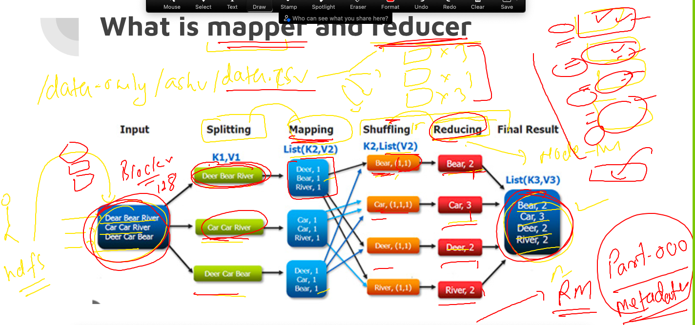
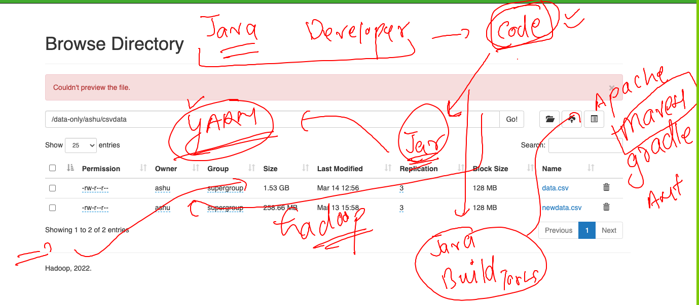
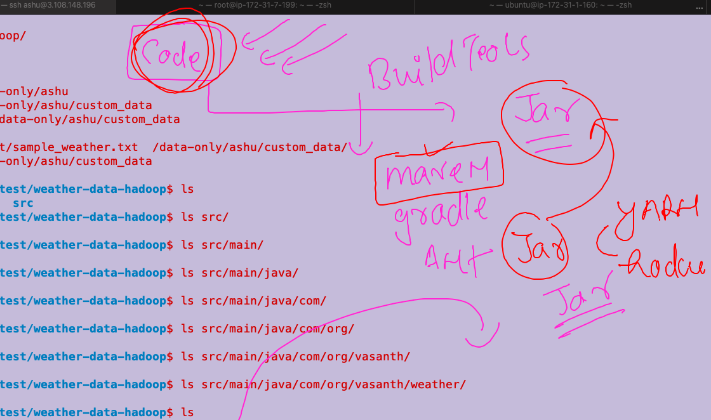

## hadoop by apache foundation -- hadoop v2 / hadoop v3 

### setup of hadoop v3 / v2 -- multinode cluster -- 1 namenode , 2 datanode 


### creating 3 vms of oracle linux / redhat linux / amazon linux / ubuntu 20 or later 
### i am using ubuntu linux 22 

## common steps to all the vm 

### checking os version 
```
ubuntu@ip-172-31-37-1:~$ cat /etc/os-release 
PRETTY_NAME="Ubuntu 22.04.1 LTS"
NAME="Ubuntu"
VERSION_ID="22.04"
VERSION="22.04.1 LTS (Jammy Jellyfish)"
VERSION_CODENAME=jammy
ID=ubuntu
ID_LIKE=debian
HOME_URL="https://www.ubuntu.com/"
SUPPORT_URL="https://help.ubuntu.com/"
BUG_REPORT_URL="https://bugs.launchpad.net/ubuntu/"
PRIVACY_POLICY_URL="https://www.ubuntu.com/legal/terms-and-policies/privacy-policy"
UBUNTU_CODENAME=jammy

```

### update apt repo 

```
ubuntu@ip-172-31-37-1:~$ sudo apt update 
Hit:1 http://ap-south-1.ec2.archive.ubuntu.com/ubuntu jammy InRelease
Get:2 http://ap-south-1.ec2.archive.ubuntu.com/ubuntu jammy-updates InRelease [119 kB]
Get:3 http://security.ubuntu.com/ubuntu jammy-security InRelease [110 kB]             

```

### Installing jdk8 & setup path of java 

```
ubuntu@ip-172-31-37-1:~$ sudo apt install openjdk-8-jdk 
Reading package lists... Done
Building dependency tree... Done
Reading state information... Done
The following additional packages will be installed:
  adwaita-icon-theme alsa-topology-conf alsa-ucm-conf at-spi2-core ca-certificates-java dconf-gsettings-backend
  dconf-service fontconfig fontconfig-config fonts-d
  
  =========>checking java version 
  
  
  ubuntu@ip-172-31-37-1:~$ java -version 
openjdk version "1.8.0_362"
OpenJDK Runtime Environment (build 1.8.0_362-8u362-ga-0ubuntu1~22.04-b09)
OpenJDK 64-Bit Server VM (build 25.362-b09, mixed mode)
ubuntu@ip-172-31-37-1:~$ 

===============> setup java path 

ubuntu@ip-172-31-37-1:~$ cd  /usr/lib/jvm/
ubuntu@ip-172-31-37-1:/usr/lib/jvm$ ls
java-1.8.0-openjdk-amd64  java-8-openjdk-amd64
ubuntu@ip-172-31-37-1:/usr/lib/jvm$ cd java-8-openjdk-amd64/
ubuntu@ip-172-31-37-1:/usr/lib/jvm/java-8-openjdk-amd64$ ls
ASSEMBLY_EXCEPTION  THIRD_PARTY_README  bin  docs  include  jre  lib  man  src.zip
ubuntu@ip-172-31-37-1:/usr/lib/jvm/java-8-openjdk-amd64$ pwd
/usr/lib/jvm/java-8-openjdk-amd64
ubuntu@ip-172-31-37-1:/usr/lib/jvm/java-8-openjdk-amd64$ vim  ~/.bashrc 
ubuntu@ip-172-31-37-1:/usr/lib/jvm/java-8-openjdk-amd64$ tail -4  ~/.bashrc 

export JAVA_HOME=/usr/lib/jvm/java-8-openjdk-amd64
PATH=$PATH:$JAVA_HOME/bin
export PATH
ubuntu@ip-172-31-37-1:/usr/lib/jvm/java-8-openjdk-amd64$ source ~/.bashrc 
ubuntu@ip-172-31-37-1:/usr/lib/jvm/java-8-openjdk-amd64$ 
ubuntu@ip-172-31-37-1:/usr/lib/jvm/java-8-openjdk-amd64$ echo $JAVA_HOME
/usr/lib/jvm/java-8-openjdk-amd64


```

### Download apache hadoop tar 

```

ubuntu@ip-172-31-37-1:~$ wget https://downloads.apache.org/hadoop/common/hadoop-3.2.4/hadoop-3.2.4.tar.gz
--2023-03-14 05:02:01--  https://downloads.apache.org/hadoop/common/hadoop-3.2.4/hadoop-3.2.4.tar.gz
Resolving downloads.apache.org (downloads.apache.org)... 88.99.95.219, 135.181.214.104, 2a01:4f9:3a:2c57::2, ...
Connecting to downloads.apache.org (downloads.apache.org)|88.99.95.219|:443... connected.
HTTP request sent, awaiting response... 200 OK
Length: 492368219 (470M) [application/x-gzip]
Saving to: ‘hadoop-3.2.4.tar.gz’

hadoop-3.2.4.tar.gz            43%[====================>                             ] 203.70M 

====>
tar xvzf  hadoop-3.2.4.tar.gz
ubuntu@ip-172-31-37-1:~$ ls
hadoop-3.2.4  hadoop-3.2.4.tar.gz

```

## NameNode setup  --- 

### hadoop-env.sh to setup java_Home path 
```
ubuntu@ip-172-31-37-1:~$ whoami
ubuntu
ubuntu@ip-172-31-37-1:~$ pwd
/home/ubuntu
ubuntu@ip-172-31-37-1:~$ ls
hadoop-3.2.4
ubuntu@ip-172-31-37-1:~$ cd hadoop-3.2.4/
ubuntu@ip-172-31-37-1:~/hadoop-3.2.4$ ls
LICENSE.txt  NOTICE.txt  README.txt  bin  etc  include  lib  libexec  sbin  share
ubuntu@ip-172-31-37-1:~/hadoop-3.2.4$ cd etc/
ubuntu@ip-172-31-37-1:~/hadoop-3.2.4/etc$ ls
hadoop
ubuntu@ip-172-31-37-1:~/hadoop-3.2.4/etc$ cd hadoop/
ubuntu@ip-172-31-37-1:~/hadoop-3.2.4/etc/hadoop$ ls
capacity-scheduler.xml      hadoop-user-functions.sh.example  kms-log4j.properties        ssl-client.xml.example
configuration.xsl           hdfs-site.xml                     kms-site.xml                ssl-server.xml.example
container-executor.cfg      httpfs-env.sh                     log4j.properties            user_ec_policies.xml.template
core-site.xml               httpfs-log4j.properties           mapred-env.cmd              workers
hadoop-env.cmd              httpfs-signature.secret           mapred-env.sh               yarn-env.cmd
hadoop-env.sh               httpfs-site.xml                   mapred-queues.xml.template  yarn-env.sh
hadoop-metrics2.properties  kms-acls.xml                      mapred-site.xml             yarn-site.xml
hadoop-policy.xml           kms-env.sh                        shellprofile.d              yarnservice-log4j.properties
ubuntu@ip-172-31-37-1:~/hadoop-3.2.4/etc/hadoop$ echo $JAVA_HOME
/usr/lib/jvm/java-8-openjdk-amd64
ubuntu@ip-172-31-37-1:~/hadoop-3.2.4/etc/hadoop$ vim hadoop-env.sh 
ubuntu@ip-172-31-37-1:~/hadoop-3.2.4/etc/hadoop$ 


```

### core-site.xml 

```
<configuration>
	<property>
		<name>fs.defaultFS</name>
		<value>hdfs://15.206.91.13:9000</value>
		<description>namenode endpoint URL ,will be shared to DN and clients</description>
	</property>

</configuration>
```

### namenode hdfs-site.xml 

```
<configuration>
	<property>
		<name>dfs.namenode.name.dir</name>
		<value>/home/ubuntu/oracle/nn_metadata</value>
		<description>namenode metadata storage location </description>
	</property>

</configuration>
```

### to format above location in hdfs-site.xml we have to format namenode only first time while creating it 

```
   72  hdfs  namenode -format 
   73  history 
ubuntu@ip-172-31-37-1:~$ ls
hadoop-3.2.4  oracle
ubuntu@ip-172-31-37-1:~$ cd oracle/
ubuntu@ip-172-31-37-1:~/oracle$ ls
nn_metadata
ubuntu@ip-172-31-37-1:~/oracle$ cd nn_metadata/
ubuntu@ip-172-31-37-1:~/oracle/nn_metadata$ ls
current
ubuntu@ip-172-31-37-1:~/oracle/nn_metadata$ cd current/
ubuntu@ip-172-31-37-1:~/oracle/nn_metadata/current$ ls
VERSION  fsimage_0000000000000000000  fsimage_0000000000000000000.md5  seen_txid
ubuntu@ip-172-31-37-1:~/oracle/nn_metadata/current$ 

```

## new strategy setup 


### Namenode + Resource manager  -- machine only 

### mapred-site.xml

```
<configuration>
   <property>
    <name>mapreduce.jobtracker.address</name>
    <value>15.206.91.13:54311</value>
  </property>
  <property>
    <name>mapreduce.framework.name</name>
    <value>yarn</value>
  </property>
</configuration>
```

### yarn-site.xml 

```
	   <property>
    <name>yarn.nodemanager.aux-services</name>
    <value>mapreduce_shuffle</value>
  </property>
  <property>
    <name>yarn.resourcemanager.hostname</name>
    <value>ec2-15-206-91-13.ap-south-1.compute.amazonaws.com</value>
  </property>
```


### COpy all given files to datanodes machine you want to configure 

```
ubuntu@ip-172-31-37-1:~/hadoop-3.2.4/etc/hadoop$ vim yarn-site.xml 
ubuntu@ip-172-31-37-1:~/hadoop-3.2.4/etc/hadoop$ 
ubuntu@ip-172-31-37-1:~/hadoop-3.2.4/etc/hadoop$ cat workers 
172.31.37.40
172.31.33.251
ubuntu@ip-172-31-37-1:~/hadoop-3.2.4/etc/hadoop$ scp  hadoop-env.sh  core-site.xml  mapred-site.xml  yarn-site.xml     172.31.37.40:/home/ubuntu/hadoop-3.2.4/etc/hadoop/ 
hadoop-env.sh                                                                      100%   16KB  14.9MB/s   00:00    
core-site.xml                                                                      100%  954     1.2MB/s   00:00    
mapred-site.xml                                                                    100%  962     1.3MB/s   00:00    
yarn-site.xml                                                                      100%  946     1.4MB/s   00:00    
ubuntu@ip-172-31-37-1:~/hadoop-3.2.4/etc/hadoop$ scp  hadoop-env.sh  core-site.xml  mapred-site.xml  yarn-site.xml     172.31.33.251:/home/ubuntu/hadoop-3.2.4/etc/hadoop/ 
hadoop-env.sh                                                                      100%   16KB   9.2MB/s   00:00    
core-site.xml                                                                      100%  954     1.2MB/s   00:00    
mapred-site.xml                                                                    100%  962     1.0MB/s   00:00    
yarn-site.xml             
```


### Only datanode side changes will in hdfs-site.xml 

```
	<property>
		<name>dfs.datanode.data.dir</name>
		<value>/home/ubuntu/mydatanode/</value>
		<description>namenode metadata storage location </description>
	</property>
```

### all --- THis step we have to do only in namenode -- and only first time while setup 

```
 ubuntu@ip-172-31-37-1:~$ hdfs namenode -format 
2023-03-14 06:34:43,764 INFO namenode.NameNode: STARTUP_MSG: 
/************************************************************
STARTUP_MSG: Starting NameNode
STARTUP_MSG:   host = ip-172-31-37-1.ap-south-1.compute.internal/172.31.37.1
STARTUP_MSG:   args = [-format]
STARTUP_MSG:   version = 3.2.4
STARTUP_MSG:   classpath = /h
 
```

### we are going to start all the services from namenode itself 

```
ubuntu@ip-172-31-37-1:~$ start-all.sh 
WARNING: Attempting to start all Apache Hadoop daemons as ubuntu in 10 seconds.
WARNING: This is not a recommended production deployment configuration.
WARNING: Use CTRL-C to abort.
Starting namenodes on [15.206.91.13]
Starting datanodes
Starting secondary namenodes [ip-172-31-37-1]
Starting resourcemanager
Starting nodemanagers
ubuntu@ip-172-31-37-1:~$ jps
7778 SecondaryNameNode
8231 Jps
7950 ResourceManager
ubuntu@ip-172-31-37-1:~$ stop -all.sh 
Command 'stop' not found, but there are 21 similar ones.
ubuntu@ip-172-31-37-1:~$ stop-all.sh 
WARNING: Stopping all Apache Hadoop daemons as ubuntu in 10 seconds.
WARNING: Use CTRL-C to abort.
Stopping namenodes on [15.206.91.13]
Stopping datanodes
Stopping secondary namenodes [ip-172-31-37-1]
Stopping nodemanagers
Stopping resourcemanager
ubuntu@ip-172-31-37-1:~$ 


```

### wordcount logic with map reduce 



### creating and upload sample data in HDFS so that we can process it via YARN / mapreduce

```
328  yes  "hello,world,bigdata,java,python"  >data.csv 
  329  ls -lh data.csv 
  330  yes  "hello,world,bigdata,java,python"  >data.csv 
  331  ls -lh data.csv 
  332  cat -n data.csv 
  333  history 
ashu@ip-172-31-1-160:~$ yes  "hi,ok,hadoop,scala"  >>data.csv 
^C
ashu@ip-172-31-1-160:~$ ls -lh  data.csv 
-rw-rw-r-- 1 ashu ashu 1.6G Mar 14 07:25 data.csv
ashu@ip-172-31-1-160:~$ 
ashu@ip-172-31-1-160:~$ 
ashu@ip-172-31-1-160:~$ hdfs dfs -ls /data-only/ashu
Found 2 items
drwxr-xr-x   - ashu supergroup          0 2023-03-13 10:28 /data-only/ashu/csvdata
drwxr-xr-x   - ashu supergroup          0 2023-03-13 13:59 /data-only/ashu/textdata
ashu@ip-172-31-1-160:~$ hdfs  dfs -put data.csv   /data-only/ashu/csvdata/
ashu@ip-172-31-1-160:~$ 
ashu@ip-172-31-1-160:~$ hdfs dfs -ls /data-only/ashu/csvdata
Found 2 items
-rw-r--r--   3 ashu supergroup 1638846464 2023-03-14 07:26 /data-only/ashu/csvdata/data.csv
-rw-r--r--   3 ashu supergroup  271221040 2023-03-13 10:28 /data-only/ashu/csvdata/newdata.csv
```

## YARN / MAPREduce -- they need java program to process data 

### java program  -->(mvn)----> jar / war 

### workflow 



### checking sample jar files by hadoop framework itself 

```
ashu@ip-172-31-1-160:~$ 
ashu@ip-172-31-1-160:~$ 
ashu@ip-172-31-1-160:~$ cd hadoop-3.2.3/
ashu@ip-172-31-1-160:~/hadoop-3.2.3$ ls
LICENSE.txt  NOTICE.txt  README.txt  bin  etc  include  lib  libexec  sbin  share
ashu@ip-172-31-1-160:~/hadoop-3.2.3$ cd share/
ashu@ip-172-31-1-160:~/hadoop-3.2.3/share$ ls
doc  hadoop
ashu@ip-172-31-1-160:~/hadoop-3.2.3/share$ cd hadoop/
ashu@ip-172-31-1-160:~/hadoop-3.2.3/share/hadoop$ ls
client  common  hdfs  mapreduce  tools  yarn
ashu@ip-172-31-1-160:~/hadoop-3.2.3/share/hadoop$ cd mapreduce/
ashu@ip-172-31-1-160:~/hadoop-3.2.3/share/hadoop/mapreduce$ ls
hadoop-mapreduce-client-app-3.2.3.jar              hadoop-mapreduce-client-shuffle-3.2.3.jar
hadoop-mapreduce-client-common-3.2.3.jar           hadoop-mapreduce-client-uploader-3.2.3.jar
hadoop-mapreduce-client-core-3.2.3.jar             hadoop-mapreduce-examples-3.2.3.jar
hadoop-mapreduce-client-hs-3.2.3.jar               jdiff
hadoop-mapreduce-client-hs-plugins-3.2.3.jar       lib
hadoop-mapreduce-client-jobclient-3.2.3-tests.jar  lib-examples
hadoop-mapreduce-client-jobclient-3.2.3.jar        sources
hadoop-mapreduce-client-nativetask-3.2.3.jar
```

### checking sample options in jar file 

```
ashu@ip-172-31-1-160:~/hadoop-3.2.3/share/hadoop/mapreduce$ hadoop  jar  hadoop-mapreduce-examples-3.2.3.jar  
An example program must be given as the first argument.
Valid program names are:
  aggregatewordcount: An Aggregate based map/reduce program that counts the words in the input files.
  aggregatewordhist: An Aggregate based map/reduce program that computes the histogram of the words in the input files.
  bbp: A map/reduce program that uses Bailey-Borwein-Plouffe to compute exact digits of Pi.
  dbcount: An example job that count the pageview counts from a database.
  distbbp: A map/reduce program that uses a BBP-type formula to compute exact bits of Pi.
  grep: A map/reduce program that counts the matches of a regex in the input.
  join: A job that effects a join over sorted, equally partitioned datasets
  multifilewc: A job that counts words from several files.
  pentomino: A map/reduce tile laying program to find solutions to pentomino problems.
  pi: A map/reduce program that estimates Pi using a quasi-Monte Carlo method.
  randomtextwriter: A map/reduce program that writes 10GB of random textual data per node.
  randomwriter: A map/reduce program that writes 10GB of random data per node.
  secondarysort: An example defining a secondary sort to the reduce.
  sort: A map/reduce program that sorts the data written by the random writer.
  sudoku: A sudoku solve
```

### Running wordcount operation --

```
 yarn jar hadoop-mapreduce-examples-3.2.3.jar  wordcount /data-only/ashu/csvdata/data.csv  /data-only/ashu/csvdata/ashuwcout1
```

### One more example 

```
 435  yes hello world this is hadoop  >/tmp/a.txt 
  436  ls -lh /tmp/a.txt 
  437  hdfs dfs -put /tmp/a.txt  /data-only/ashu/textdata/
  438  hdfs dfs -ls /data-only/ashu/textdata/
  439  yarn jar hadoop-mapreduce-examples-3.2.3.jar  wordcount /data-only/ashu/textdata/a.txt  /data-only/ashu/textdata/out1 
  440  history 
ashu@ip-172-31-1-160:~/hadoop-3.2.3/share/hadoop/mapreduce$ hdfs dfs -ls /data-only/ashu/textdata/
Found 3 items
-rw-r--r--   3 ashu supergroup  805613568 2023-03-14 09:41 /data-only/ashu/textdata/a.txt
drwxr-xr-x   - ashu supergroup          0 2023-03-14 09:43 /data-only/ashu/textdata/out1
-rw-r--r--   3 ashu supergroup      12053 2023-03-14 09:16 /data-only/ashu/textdata/sample_weather.txt
ashu@ip-172-31-1-160:~/hadoop-3.2.3/share/hadoop/mapreduce$ hdfs dfs -ls /data-only/ashu/textdata/out1
Found 2 items
-rw-r--r--   3 ashu supergroup          0 2023-03-14 09:43 /data-only/ashu/textdata/out1/_SUCCESS
-rw-r--r--   3 ashu supergroup         78 2023-03-14 09:43 /data-only/ashu/textdata/out1/part-r-00000
ashu@ip-172-31-1-160:~/hadoop-3.2.3/share/hadoop/mapreduce$ hdfs dfs -cat /data-only/ashu/textdata/out1/part-r-00000
hadoop	29837539
hello	29837540
is	29837539
thi	1
this	29837539
world	29837540

```


## data of weather forcast and process it through a particular custom java code 

### cloning code and dataset 

```
ashu@ip-172-31-1-160:~$ mkdir new-test
ashu@ip-172-31-1-160:~$ cd new-test/
ashu@ip-172-31-1-160:~/new-test$ ls
ashu@ip-172-31-1-160:~/new-test$ ls -a
.  ..
ashu@ip-172-31-1-160:~/new-test$ git clone https://github.com/vasanth-mahendran/weather-data-hadoop.git
Cloning into 'weather-data-hadoop'...
remote: Enumerating objects: 36, done.
remote: Counting objects: 100% (36/36), done.
remote: Compressing objects: 100% (15/15), done.
remote: Total 36 (delta 3), reused 36 (delta 3), pack-reused 0
Receiving objects: 100% (36/36), 7.82 KiB | 1.56 MiB/s, done.
Resolving deltas: 100% (3/3), done.
ashu@ip-172-31-1-160:~/new-test$ ls
weather-data-hadoop

```

### uploading data in HDFS 

```
ashu@ip-172-31-1-160:~/new-test/weather-data-hadoop$ hdfs dfs  -mkdir   /data-only/ashu/custom_data
ashu@ip-172-31-1-160:~/new-test/weather-data-hadoop$ ls
README.md  dataset  pom.xml  src
ashu@ip-172-31-1-160:~/new-test/weather-data-hadoop$ hdfs dfs -put dataset/sample_weather.txt  /data-only/ashu/custom_data/
ashu@ip-172-31-1-160:~/new-test/weather-data-hadoop$ hdfs dfs  -ls  /data-only/ashu/custom_data
Found 1 items
-rw-r--r--   3 ashu supergroup      12053 2023-03-14 10:53 /data-only/ashu/custom_data/sample_weather.txt
```


### COnverting code into jar using apache maven build 



### lets build using maven 

```
shu@ip-172-31-1-160:~/new-test/weather-data-hadoop$ ls
README.md  dataset  pom.xml  src
ashu@ip-172-31-1-160:~/new-test/weather-data-hadoop$ mvn install
[INFO] Scanning for projects...
[INFO] 
[INFO] ----------------------< com.org.vasanth:weather >-----------------------
[INFO] Building weather 1.0
[INFO] --------------------------------[ jar ]---------------------------------
[INFO] 
[INFO] --- maven-resources-plugin:2.6:resources (default-resources) @ weather ---
[INFO] Using 'UTF-8' encoding to copy filtered resources.
[INFO] skip non existing resourceDirectory /home/ashu/new-test/weather-data-hadoop/src/main/resources
[INFO] 
[INFO] --- maven-compiler-plugin:3.1:compile (default-compile) @ weather ---
[INFO] Changes detected - recompiling the module!
[INFO] Compiling 1 source file to /home/ashu/new-test/weather-data-hadoop/target/classes
[INFO] 
[INFO] --- maven-resources-plugin:2.6:testResources (default-testResources) @ weather ---
[INFO] Using 'UTF-8' encoding to copy filtered resources.
[INFO] skip non existing resourceDirectory /home/ashu/new-test/weather-data-hadoop/src/test/resources
[INFO] 
[INFO] --- maven-compiler-plugin:3.1:testCompile (default-testCompile) @ weather ---
[INFO] No sources to compile
[INFO] 
[INFO] --- maven-surefire-plugin:2.12.4:test (default-test) @ weather ---
[INFO] No tests to run.
[INFO] 
[INFO] --- maven-jar-plugin:2.5:jar (default-jar) @ weather ---
[INFO] Building jar: /home/ashu/new-test/weather-data-hadoop/target/weather-1.0.jar
[INFO] 
[INFO] --- maven-install-plugin:2.4:install (default-install) @ weather ---
[INFO] Installing /home/ashu/new-test/weather-data-hadoop/target/weather-1.0.jar to /home/ashu/.m2/repository/com/org/vasanth/weather/1.0/weather-1.0.jar
[INFO] Installing /home/ashu/new-test/weather-data-hadoop/pom.xml to /home/ashu/.m2/repository/com/org/vasanth/weather/1.0/weather-1.0.pom
[INFO] ------------------------------------------------------------------------
[INFO] BUILD SUCCESS
[INFO] ------------------------------------------------------------------------
[INFO] Total time:  4.063 s
[INFO] Finished at: 2023-03-14T10:59:00Z
[INFO] ------------------------------------------------------------------------
ashu@ip-172-31-1-160:~/new-test/weather-data-hadoop$ ls
README.md  dataset  pom.xml  src  target
ashu@ip-172-31-1-160:~/new-test/weather-data-hadoop$ ls target/
classes  generated-sources  maven-archiver  maven-status  weather-1.0.jar
```

### running custom code of java with apache YARN 

```
  660  yarn jar ./target/weather-1.0.jar  /data-only/ashu/custom_data/sample_weather.txt  /data-only/ashu/custom_data/output111 
  661  history 
ashu@ip-172-31-1-160:~/new-test/weather-data-hadoop$  hdfs dfs  -ls  /data-only/ashu/custom_data
Found 2 items
drwxr-xr-x   - ashu supergroup          0 2023-03-14 11:05 /data-only/ashu/custom_data/output111
-rw-r--r--   3 ashu supergroup      12053 2023-03-14 10:53 /data-only/ashu/custom_data/sample_weather.txt
ashu@ip-172-31-1-160:~/new-test/weather-data-hadoop$  hdfs dfs  -ls  /data-only/ashu/custom_data/output111
Found 2 items
-rw-r--r--   3 ashu supergroup          0 2023-03-14 11:05 /data-only/ashu/custom_data/output111/_SUCCESS
-rw-r--r--   3 ashu supergroup        287 2023-03-14 11:05 /data-only/ashu/custom_data/output111/part-00000
ashu@ip-172-31-1-160:~/new-test/weather-data-hadoop$ hdfs dfs -cat /data-only/ashu/custom_data/output111/part-00000 
690190_02_section1	53.87166666666665 25.900000000000006 7.774999999999995
690190_02_section2	54.76125 25.900000000000006 7.774999999999998
690190_02_section3	53.25041666666666 25.900000000000006 7.774999999999998
690190_02_section4	52.44708333333333 25.900000000000002 7.774999999999998

```

## sudoku solver 

```
ashu@ip-172-31-1-160:~/hadoop-3.2.3/share/hadoop/mapreduce$ yarn jar hadoop-mapreduce-examples-3.2.3.jar  sudoku ~/puzzle.dta  
Solving /home/ashu/puzzle.dta
8 5 1 3 9 2 6 4 7 
4 3 2 6 7 8 1 9 5 
7 9 6 5 1 4 3 8 2 
6 1 4 8 2 3 7 5 9 
5 7 8 9 6 1 4 2 3 
3 2 9 4 5 7 8 1 6 
9 4 7 2 8 6 5 3 1 
1 8 5 7 3 9 2 6 4 
2 6 3 1 4 5 9 7 8 

Found 1 solutions
ashu@ip-172-31-1-160:~/hadoop-3.2.3/share/hadoop/mapreduce$ cat  ~/puzzle.dta 
8 5 ? 3 9 ? ? ? ?
? ? 2 ? ? ? ? ? ?
? ? 6 ? 1 ? ? ? 2
? ? 4 ? ? 3 ? 5 9
? ? 8 9 ? 1 4 ? ?
3 2 ? 4 ? ? 8 ? ?
9 ? ? ? 8 ? 5 ? ?
? ? ? ? ? ? 2 ? ?
? ? ? ? 4 5 ? 7 8

```


