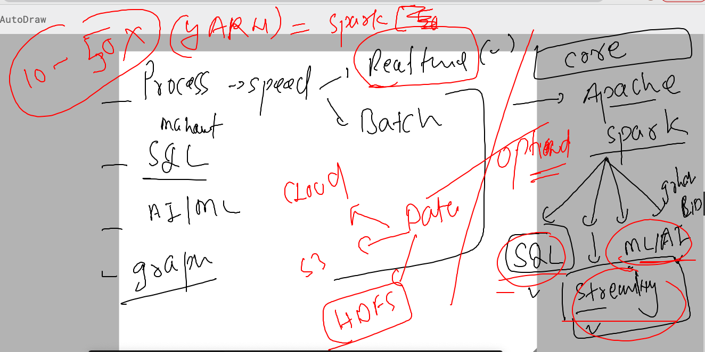
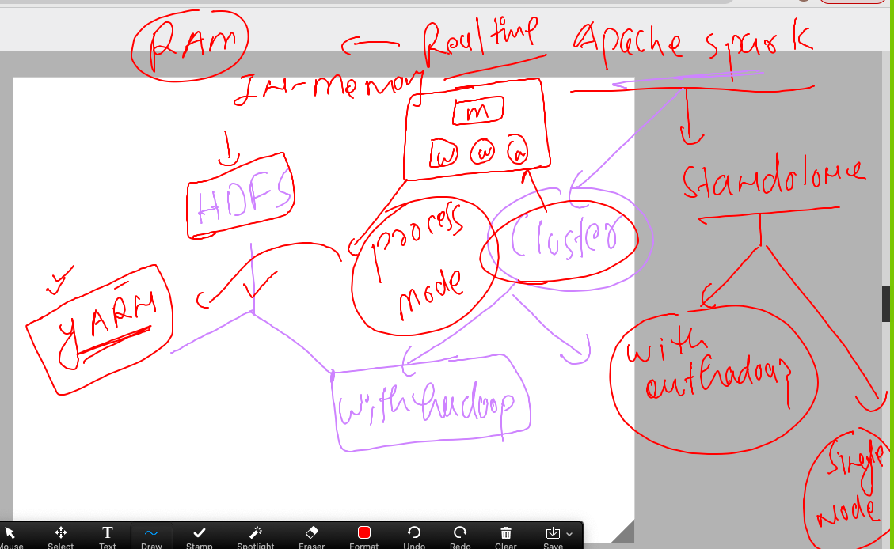
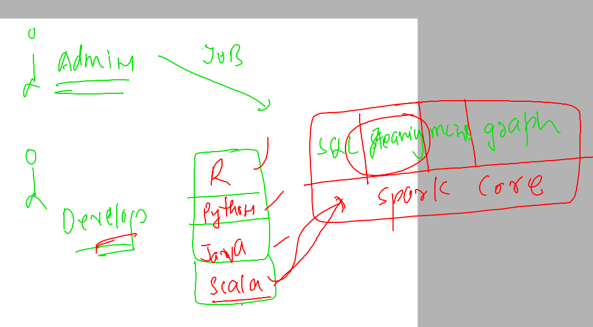
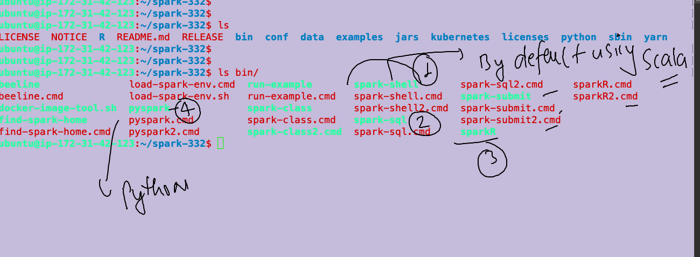
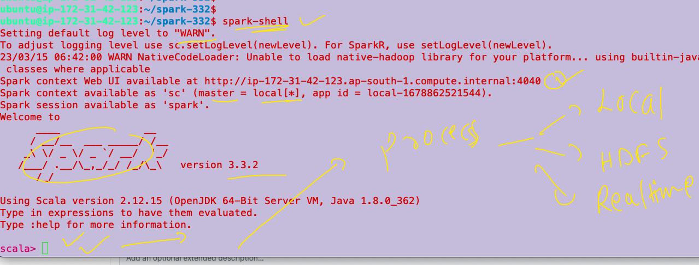
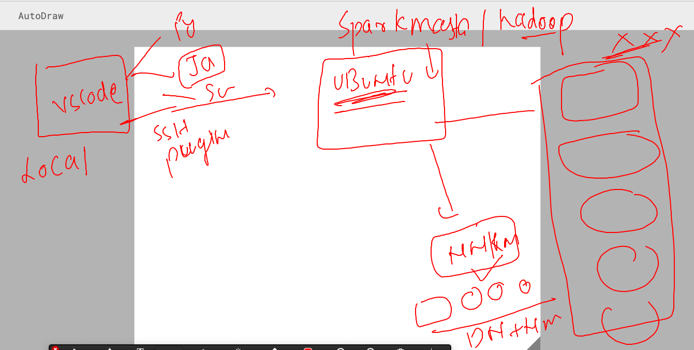
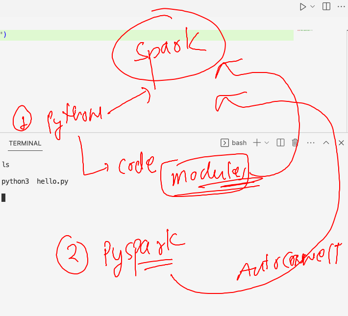
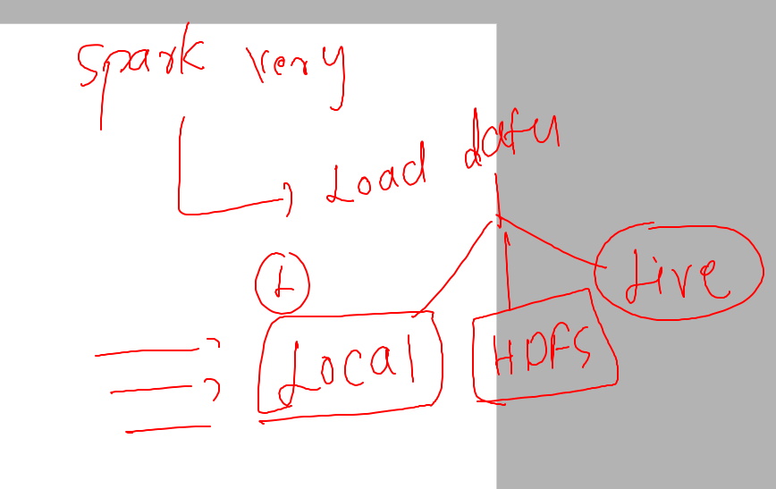

### plan of the day 


### HDFS & YARN / MR v1 -- will be used to solve problems 

### use case 1


### spark introduction 



### more details about apache spark 



### final info about spark 



## spark setup options 

### using spark standalone -- single node -- no hadoop framework 

```
ubuntu@ip-172-31-42-123:~$ wget https://dlcdn.apache.org/spark/spark-3.3.2/spark-3.3.2-bin-hadoop3.tgz
--2023-03-15 06:28:42--  https://dlcdn.apache.org/spark/spark-3.3.2/spark-3.3.2-bin-hadoop3.tgz
Resolving dlcdn.apache.org (dlcdn.apache.org)... 151.101.2.132, 2a04:4e42::644
Connecting to dlcdn.apache.org (dlcdn.apache.org)|151.101.2.132|:443... connected.
HTTP request sent, awaiting response... 200 OK
Length: 299360284 (285M) [application/x-gzip]
Saving to: ‘spark-3.3.2-bin-hadoop3.tgz’

spark-3.3.2-bin-hadoop3.tgz   100%[==============================================>] 285.49M  97.1MB/s    in 2.9s    

2023-03-15 06:28:46 (97.1 MB/s) - ‘spark-3.3.2-bin-hadoop3.tgz’ saved [299360284/299360284]

ubuntu@ip-172-31-42-123:~$ ls
hadoop-323  spark-3.3.2-bin-hadoop3.tgz
ubuntu@ip-172-31-42-123:~$ 

```

### extracting 

```
  90  tar xvzf  spark-3.3.2-bin-hadoop3.tgz 
   91  ls
   92  history 
ubuntu@ip-172-31-42-123:~$ ls
hadoop-323  spark-3.3.2-bin-hadoop3  spark-3.3.2-bin-hadoop3.tgz
ubuntu@ip-172-31-42-123:~$ 

```

### setting path 

```
ubuntu@ip-172-31-42-123:~$ ls
hadoop-323  spark-332
ubuntu@ip-172-31-42-123:~$ cd  spark-332/
ubuntu@ip-172-31-42-123:~/spark-332$ ls
LICENSE  NOTICE  R  README.md  RELEASE  bin  conf  data  examples  jars  kubernetes  licenses  python  sbin  yarn
ubuntu@ip-172-31-42-123:~/spark-332$ pwd
/home/ubuntu/spark-332
ubuntu@ip-172-31-42-123:~/spark-332$ vim ~/.bashrc 
ubuntu@ip-172-31-42-123:~/spark-332$ tail -6  ~/.bashrc 
HADOOP_HOME=/home/ubuntu/hadoop-323
SPARK_HOME=/home/ubuntu/spark-332
PATH=$PATH:$JAVA_HOME/bin:$HADOOP_HOME/bin:$SPARK_HOME/bin:$SPARK_HOME/sbin
export PATH


ubuntu@ip-172-31-42-123:~/spark-332$ source  ~/.bashrc 
ubuntu@ip-172-31-42-123:~/spark-332$ echo $SPARK_HOME
/home/ubuntu/spark-332
ubuntu@ip-172-31-42-123:~/spark-332$ 
```

### tools / options to work in spark 



### spark-shell --  --- SCALA 



```
ubuntu@ip-172-31-42-123:~/spark-332$ spark-shell 
Setting default log level to "WARN".
To adjust logging level use sc.setLogLevel(newLevel). For SparkR, use setLogLevel(newLevel).
23/03/15 06:42:00 WARN NativeCodeLoader: Unable to load native-hadoop library for your platform... using builtin-java classes where applicable
Spark context Web UI available at http://ip-172-31-42-123.ap-south-1.compute.internal:4040
Spark context available as 'sc' (master = local[*], app id = local-1678862521544).
Spark session available as 'spark'.
Welcome to
      ____              __
     / __/__  ___ _____/ /__
    _\ \/ _ \/ _ `/ __/  '_/
   /___/ .__/\_,_/_/ /_/\_\   version 3.3.2
      /_/
         
Using Scala version 2.12.15 (OpenJDK 64-Bit Server VM, Java 1.8.0_362)
Type in expressions to have them evaluated.
Type :help for more information.

scala> 

```

## SEtup multinode cluster of apache spark -- for huge data realtime process 

### things to do in all the nodes 

```
ubuntu@ip-172-31-1-160:~/spark-332$ cd conf/
ubuntu@ip-172-31-1-160:~/spark-332/conf$ ls
fairscheduler.xml.template  metrics.properties.template   spark-env.sh.template
log4j2.properties.template  spark-defaults.conf.template  workers.template
ubuntu@ip-172-31-1-160:~/spark-332/conf$ mv  spark-env.sh.template  spark-env.sh
ubuntu@ip-172-31-1-160:~/spark-332/conf$ ls
fairscheduler.xml.template  metrics.properties.template   spark-env.sh
log4j2.properties.template  spark-defaults.conf.template  workers.template
ubuntu@ip-172-31-1-160:~/spark-332/conf$ mv  log4j2.properties.template  log4j2.properties
ubuntu@ip-172-31-1-160:~/spark-332/conf$ ls
fairscheduler.xml.template  metrics.properties.template   spark-env.sh
log4j2.properties           spark-defaults.conf.template  workers.template
ubuntu@ip-172-31-1-160:~/spark-332/conf$ mv spark-defaults.conf.template  spark-defaults.conf
ubuntu@ip-172-31-1-160:~/spark-332/conf$ ls
fairscheduler.xml.template  metrics.properties.template  spark-env.sh
log4j2.properties           spark-defaults.conf          workers.template
```

### all machine need same config -- that is ip address of master node 

```
ubuntu@ip-172-31-1-160:~/spark-332/conf$ cat spark-defaults.conf 
#
# Licensed to the Apache Software Foundation (ASF) under one or more
# contributor license agreements.  See the NOTICE file distributed with
# this work for additional information regarding copyright ownership.
# The ASF licenses this file to You under the Apache License, Version 2.0
# (the "License"); you may not use this file except in compliance with
# the License.  You may obtain a copy of the License at
#
#    http://www.apache.org/licenses/LICENSE-2.0
#
# Unless required by applicable law or agreed to in writing, software
# distributed under the License is distributed on an "AS IS" BASIS,
# WITHOUT WARRANTIES OR CONDITIONS OF ANY KIND, either express or implied.
# See the License for the specific language governing permissions and
# limitations under the License.
#

# Default system properties included when running spark-submit.
# This is useful for setting default environmental settings.

# Example:
 spark.master                     spark://172.31.1.160:7077
 spark.eventLog.enabled           true

```

### only on spark master -- node 

```
ubuntu@ip-172-31-1-160:~$ start-master.sh  
starting org.apache.spark.deploy.master.Master, logging to /home/ubuntu/spark-332/logs/spark-ubuntu-org.apache.spark.deploy.master.Master-1-ip-172-31-1-160.out
ubuntu@ip-172-31-1-160:~$ ls  spark-332/
LICENSE  NOTICE  R  README.md  RELEASE  bin  conf  data  examples  jars  kubernetes  licenses  logs  python  sbin  yarn
ubuntu@ip-172-31-1-160:~$ 

```

### checking port number in spark master 

```
netstat -ntlp
```

### only node in worker 

```
ubuntu@ip-172-31-1-160:~/spark-332/conf$ start-worker.sh   spark://172.31.1.160:7077  
starting org.apache.spark.deploy.worker.Worker, logging to /home/ubuntu/spark-332/logs/spark-ubuntu-org.apache.spark.deploy.worker.Worker-1-ip-172-31-1-160.out
ubuntu@ip-172-31-1-160:~/spark-332/conf$ 

```

### systemd configuration for master & worker 

#### master node 

```
ubuntu@ip-172-31-1-160:~/spark-332$ cat  /etc/systemd/system/spark-master.service
[Unit]
Description=Apache spark master service 
After=network.target


[Service]
ExecStart=/home/ubuntu/spark-332/sbin/start-master.sh
ExecStop=/home/ubuntu/spark-332/sbin/stop-master.sh
Type=forking
User=root
Group=root

[Install]
WantedBy=multi-user.target
```

### On worker nodes 

```
ubuntu@ip-172-31-1-160:~/spark-332$ cat  /etc/systemd/system/spark-worker.service 
[Unit]
Description=Apache spark worker  service 
After=network.target


[Service]
ExecStart=/home/ubuntu/spark-332/sbin/start-worker.sh spark://172.31.1.160:7077
ExecStop=/home/ubuntu/spark-332/sbin/stop-worker.sh
Type=forking
User=root
Group=root

[Install]
WantedBy=multi-user.target
```

### testing 

```
ubuntu@ip-172-31-1-160:~/spark-332$ sudo systemctl daemon-reload 
ubuntu@ip-172-31-1-160:~/spark-332$ 
ubuntu@ip-172-31-1-160:~/spark-332$ sudo systemctl stop spark-worker 
ubuntu@ip-172-31-1-160:~/spark-332$ sudo systemctl stop spark-master 
ubuntu@ip-172-31-1-160:~/spark-332$ stop-master.sh 
stopping org.apache.spark.deploy.master.Master
ubuntu@ip-172-31-1-160:~/spark-332$ sudo systemctl start spark-master.service 
ubuntu@ip-172-31-1-160:~/spark-332$ 
ubuntu@ip-172-31-1-160:~/spark-332$ sudo systemctl enable spark-master.service 
Created symlink /etc/systemd/system/multi-user.target.wants/spark-master.service → /etc/systemd/system/spark-master.service.
ubuntu@ip-172-31-1-160:~/spark-332$ 

```

### spark setup 



### python to spark connection options 



## PYspark to read and process data 

### data sources for spark 



### using pyspark to load text file 

```
ubuntu@ip-172-31-1-160:~/ashu-project$ pyspark
Python 3.10.6 (main, Nov 14 2022, 16:10:14) [GCC 11.3.0] on linux
Type "help", "copyright", "credits" or "license" for more information.
Setting default log level to "WARN".
To adjust logging level use sc.setLogLevel(newLevel). For SparkR, use setLogLevel(newLevel).
23/03/15 09:55:41 WARN NativeCodeLoader: Unable to load native-hadoop library for your platform... using builtin-java classes where applicable
Welcome to
      ____              __
     / __/__  ___ _____/ /__
    _\ \/ _ \/ _ `/ __/  '_/
   /__ / .__/\_,_/_/ /_/\_\   version 3.3.2
      /_/

Using Python version 3.10.6 (main, Nov 14 2022 16:10:14)
Spark context Web UI available at http://ip-172-31-1-160.ap-south-1.compute.internal:4040
Spark context available as 'sc' (master = spark://172.31.1.160:7077, app id = app-20230315095543-0001).
SparkSession available as 'spark'.
>>> ashu_file=sc.textFile("file:///home/ubuntu/ashu-project/ashu_data.txt")
>>> 

```


