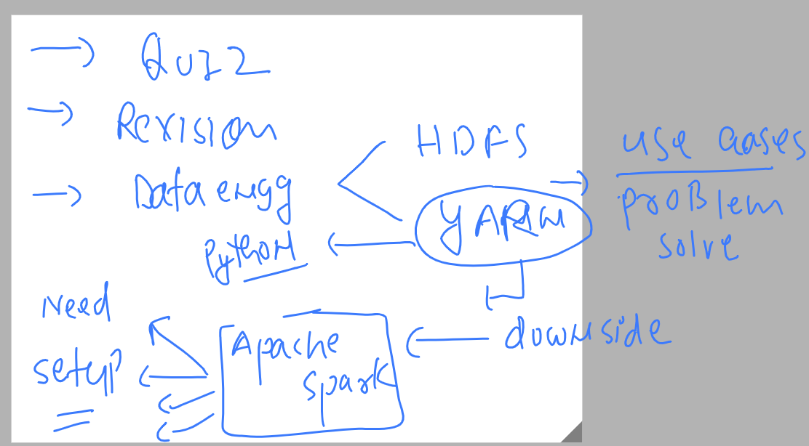
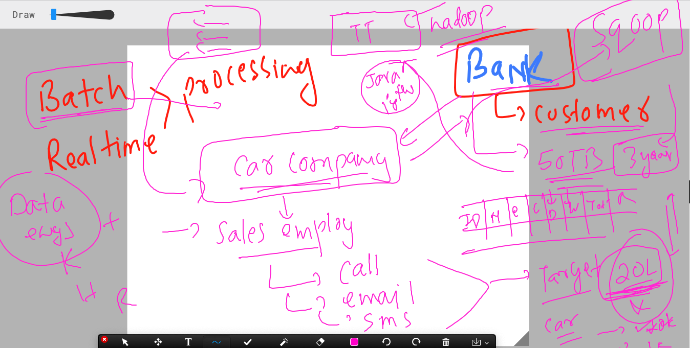

### plan of the day 



### HDFS & YARN / MR v1 -- will be used to solve problems 

### use case 1



### spark introduction 


### more details about apache spark 


### final info about spark 


## spark setup options 

### using spark standalone -- single node -- no hadoop framework 

```
ubuntu@ip-172-31-42-123:~$ wget https://dlcdn.apache.org/spark/spark-3.3.2/spark-3.3.2-bin-hadoop3.tgz
--2023-03-15 06:28:42--  https://dlcdn.apache.org/spark/spark-3.3.2/spark-3.3.2-bin-hadoop3.tgz
Resolving dlcdn.apache.org (dlcdn.apache.org)... 151.101.2.132, 2a04:4e42::644
Connecting to dlcdn.apache.org (dlcdn.apache.org)|151.101.2.132|:443... connected.
HTTP request sent, awaiting response... 200 OK
Length: 299360284 (285M) [application/x-gzip]
Saving to: ‘spark-3.3.2-bin-hadoop3.tgz’

spark-3.3.2-bin-hadoop3.tgz   100%[==============================================>] 285.49M  97.1MB/s    in 2.9s    

2023-03-15 06:28:46 (97.1 MB/s) - ‘spark-3.3.2-bin-hadoop3.tgz’ saved [299360284/299360284]

ubuntu@ip-172-31-42-123:~$ ls
hadoop-323  spark-3.3.2-bin-hadoop3.tgz
ubuntu@ip-172-31-42-123:~$ 

```

### extracting 

```
  90  tar xvzf  spark-3.3.2-bin-hadoop3.tgz 
   91  ls
   92  history 
ubuntu@ip-172-31-42-123:~$ ls
hadoop-323  spark-3.3.2-bin-hadoop3  spark-3.3.2-bin-hadoop3.tgz
ubuntu@ip-172-31-42-123:~$ 

```

### setting path 

```
ubuntu@ip-172-31-42-123:~$ ls
hadoop-323  spark-332
ubuntu@ip-172-31-42-123:~$ cd  spark-332/
ubuntu@ip-172-31-42-123:~/spark-332$ ls
LICENSE  NOTICE  R  README.md  RELEASE  bin  conf  data  examples  jars  kubernetes  licenses  python  sbin  yarn
ubuntu@ip-172-31-42-123:~/spark-332$ pwd
/home/ubuntu/spark-332
ubuntu@ip-172-31-42-123:~/spark-332$ vim ~/.bashrc 
ubuntu@ip-172-31-42-123:~/spark-332$ tail -6  ~/.bashrc 
HADOOP_HOME=/home/ubuntu/hadoop-323
SPARK_HOME=/home/ubuntu/spark-332
PATH=$PATH:$JAVA_HOME/bin:$HADOOP_HOME/bin:$SPARK_HOME/bin:$SPARK_HOME/sbin
export PATH


ubuntu@ip-172-31-42-123:~/spark-332$ source  ~/.bashrc 
ubuntu@ip-172-31-42-123:~/spark-332$ echo $SPARK_HOME
/home/ubuntu/spark-332
ubuntu@ip-172-31-42-123:~/spark-332$ 
```


