### target of the day 

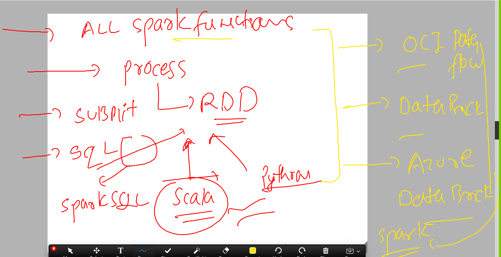

### spark architecture part 1

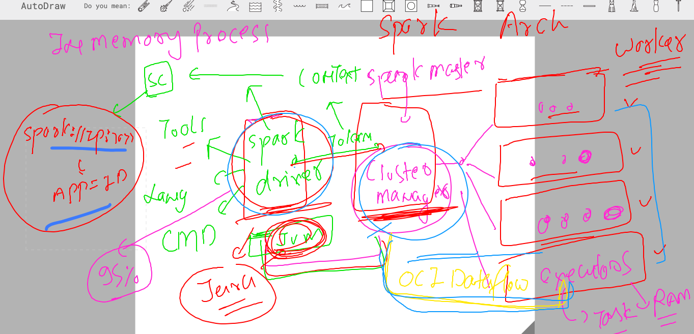


### spark architecture part 2 

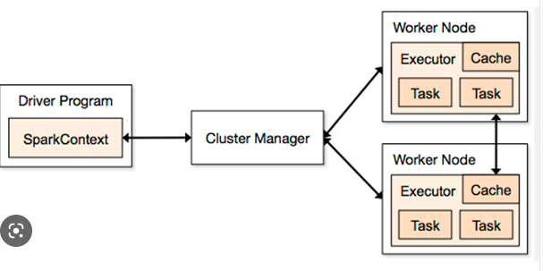

##  introduction to RDD 

### Understanding -- fault tolerance 

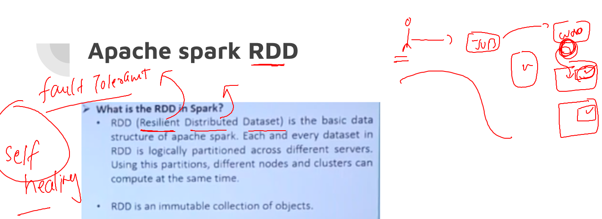

### logical partitions and distribution across worker nodes 

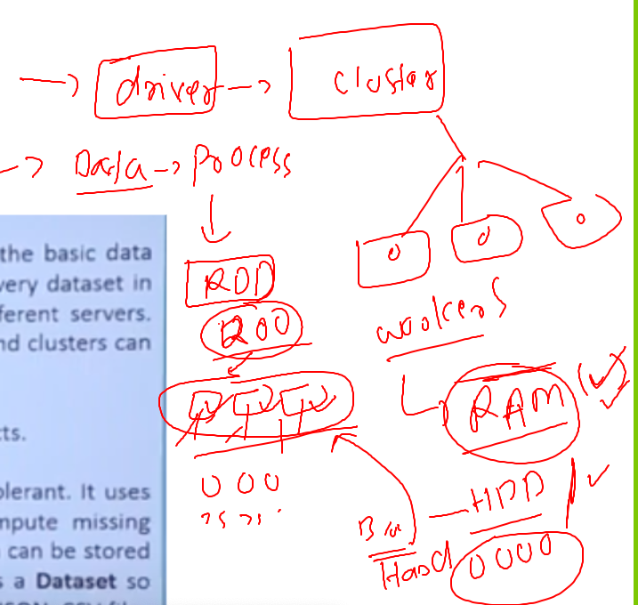

### a close look to RDD 

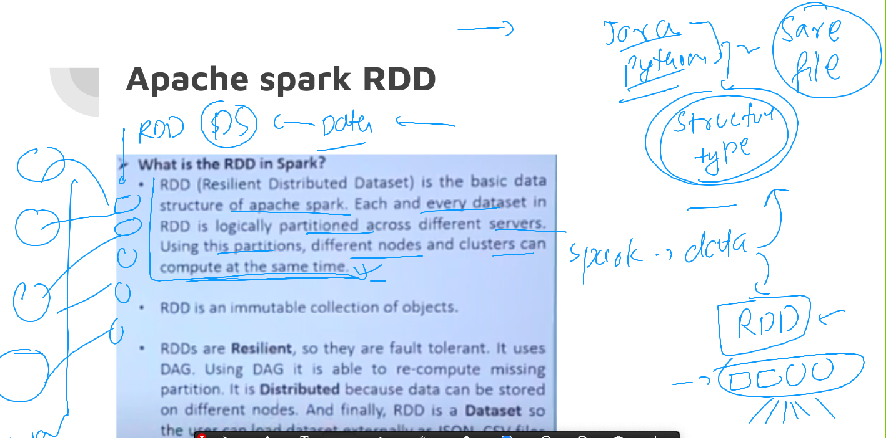

### RDD operations 

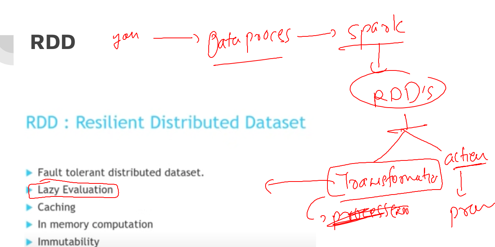

### overall RDD process

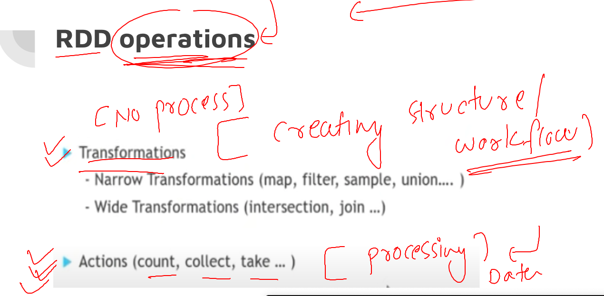

### working in rdd

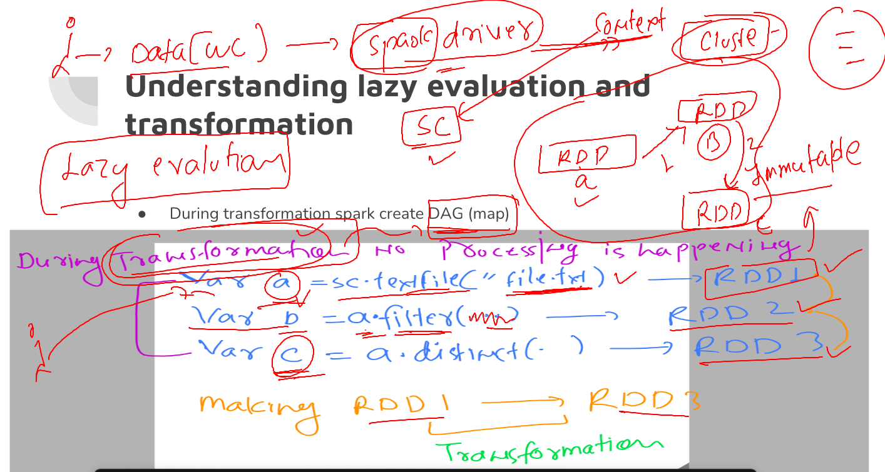

### Overl RDD in apache spark 

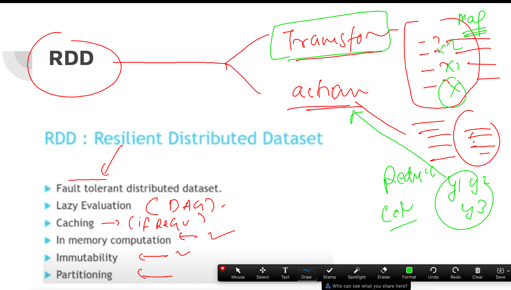

## action plan 

### creating sample data 

```
 while [ true ]; do echo  "Hello world this is apache spark"  >>ashudata.txt; echo "My name is ashutoshh singh "  >>ashudata.txt ; echo  "Python scala java R are supported language for spark" >>ashudata.txt; echo "spark core is known as spark driver " >>ashudata.txt; echo  "lets do it simply ">>ashudata.txt ; done
```

### upload this to HDFS 

```
ubuntu@ip-172-31-1-160:~/ashu-project$ ls
ashu_data.txt  ashudata.txt  hello.py  myfirstjob.py
ubuntu@ip-172-31-1-160:~/ashu-project$ hdfs dfs -ls /
Found 5 items
drwxr-xr-x   - ubuntu supergroup          0 2023-03-13 07:28 /data-only
drwxrwxr-x+  - ubuntu supergroup          0 2023-03-16 02:14 /kool
drwxrwxr-x+  - ubuntu supergroup          0 2023-03-15 02:50 /spark-events
drwxr-xr-x   - ubuntu supergroup          0 2023-03-10 06:24 /test
drwx------+  - ubuntu supergroup          0 2023-03-14 09:02 /tmp
ubuntu@ip-172-31-1-160:~/ashu-project$ hdfs dfs -ls /kool 
ubuntu@ip-172-31-1-160:~/ashu-project$ hdfs dfs -copyFromLocal ashudata.txt  /kool/
ubuntu@ip-172-31-1-160:~/ashu-project$ hdfs dfs -ls /kool 
Found 1 items
-rw-rw-r--+  3 ubuntu supergroup   40956288 2023-03-16 06:38 /kool/ashudata.txt
ubuntu@ip-172-31-1-160:~/ashu-project$ 

```

### scala var vs val for apache spark 

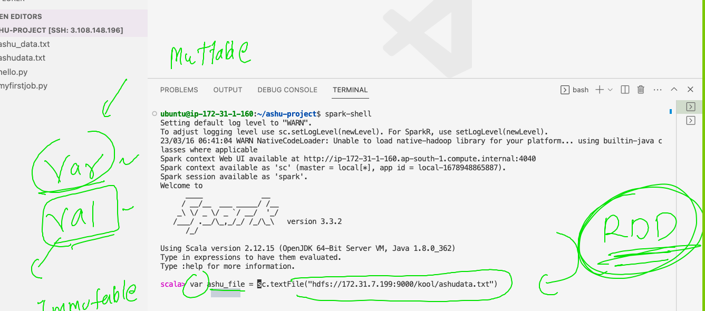

### Map vs Flatmap in spark 

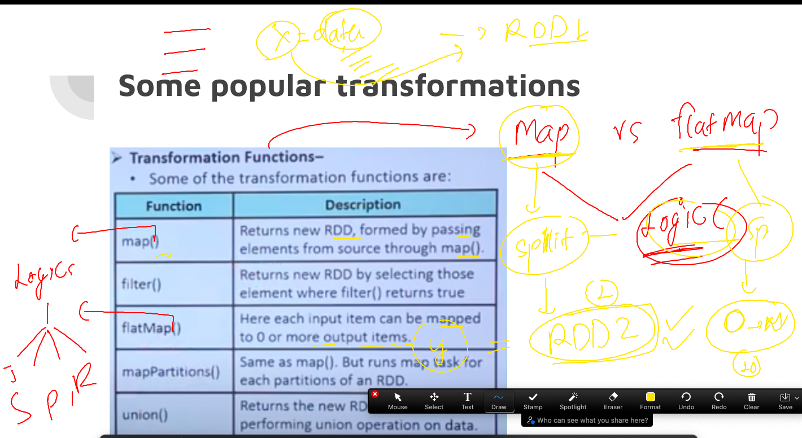

### spark-shell code 

```
ubuntu@ip-172-31-1-160:~/ashu-project$ spark-shell
Setting default log level to "WARN".
To adjust logging level use sc.setLogLevel(newLevel). For SparkR, use setLogLevel(newLevel).
23/03/16 06:41:04 WARN NativeCodeLoader: Unable to load native-hadoop library for your platform... using builtin-java classes where applicable
Spark context Web UI available at http://ip-172-31-1-160.ap-south-1.compute.internal:4040
Spark context available as 'sc' (master = local[*], app id = local-1678948865887).
Spark session available as 'spark'.
Welcome to
      ____              __
     / __/__  ___ _____/ /__
    _\ \/ _ \/ _ `/ __/  '_/
   /___/ .__/\_,_/_/ /_/\_\   version 3.3.2
      /_/
         
Using Scala version 2.12.15 (OpenJDK 64-Bit Server VM, Java 1.8.0_362)
Type in expressions to have them evaluated.
Type :help for more information.

scala> val  ashu_file = sc.textFile("hdfs://172.31.7.199:9000/kool/ashudata.txt")
ashu_file: org.apache.spark.rdd.RDD[String] = hdfs://172.31.7.199:9000/kool/ashudata.txt MapPartitionsRDD[1] at textFile at <console>:23

scala> val ashu_split = ashu_file.flatMap( x => x.split(" "))
ashu_split: org.apache.spark.rdd.RDD[String] = MapPartitionsRDD[2] at flatMap at <console>:23

scala> val ashu_map =  ashu_split.map( y => (y,1))
ashu_map: org.apache.spark.rdd.RDD[(String, Int)] = MapPartitionsRDD[3] at map at <console>:23                                 ^


scala> val ashu_count = ashu_map.reduceByKey(_+_)
ashu_count: org.apache.spark.rdd.RDD[(String, Int)] = ShuffledRDD[4] at reduceByKey at <console>:23

scala> ashu_count.collect
res1: Array[(String, Int)] = Array((scala,240920), (are,240920), (driver,240918), (this,240920), (Python,240920), (is,722758), (Hello,240920), (R,240920), (simply,240918), (language,240920), (as,240918), (apache,240920), (java,240920), (supported,240920), (My,240920), (lets,240918), (world,240920), (it,240918), (spark,963676), (name,240920), (known,240918), (do,240918), (core,240918), (singh,240920), (for,240920), (ashutoshh,240920))

scala> 

```


