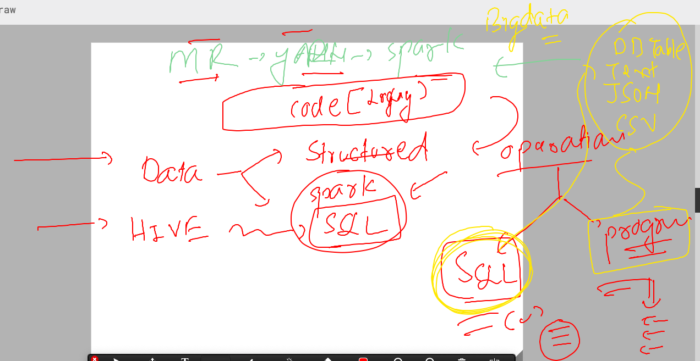
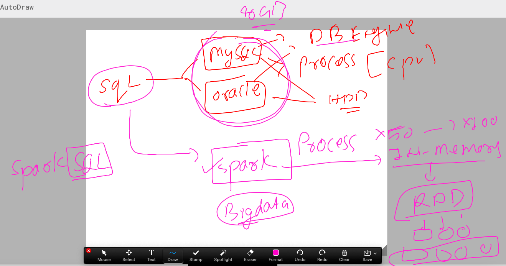
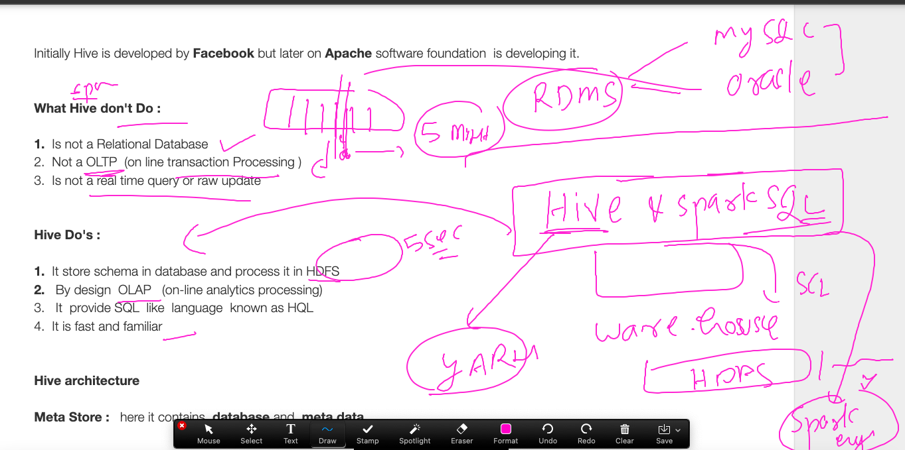
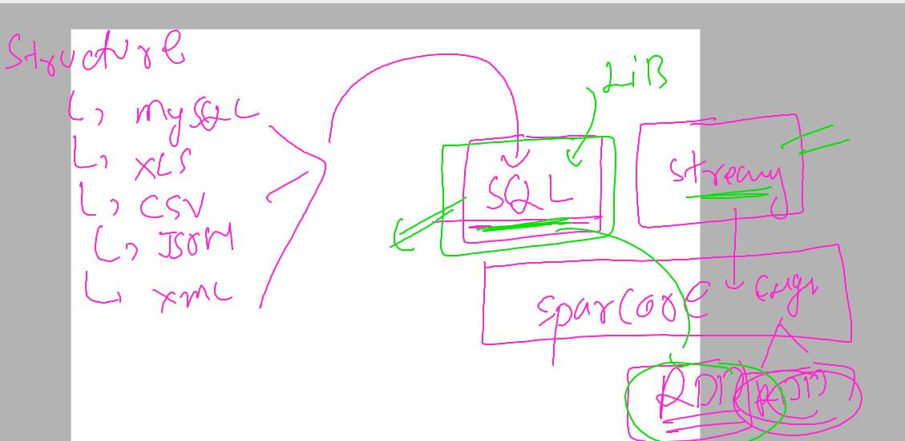
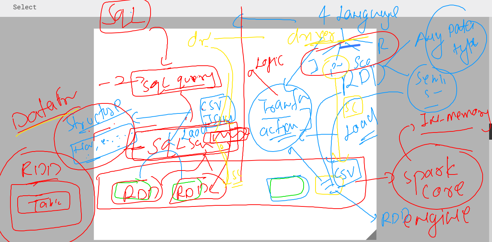

### Revision 

### rev 1 


### Revision 2 


### Revision 3 


### spark streaming getting started 


###  spark stream using python --/ pyspark for word count 

### code 

```
from pyspark import SparkContext
from pyspark.streaming import StreamingContext
# creating spark context 
sc=SparkContext("local[2]","ashu-network-data-wc")
# creating socket stream to recv data in batch interval of 2 seconds 
stream_sc=StreamingContext(sc,10) 
# use stream socket to connect target -- (hostname:port) --/localhost port
my_dataline=stream_sc.socketTextStream("localhost",9876)
# above my_dataline -- is a Dstream -- sequence of rdd 
ashu_word=my_dataline.flatMap(lambda ashu_data: ashu_data.split(" "))
# print it 
ashu_mapper=ashu_word.map(lambda ashumap: (ashumap,1))
# reducing for counting each word
ashu_wc=ashu_mapper.reduceByKey(lambda ashuk,ashuv: ashuk+ashuv)
# printing by collect / pprint 
ashu_wc.pprint()

## start listener socket 
stream_sc.start() # start compute socket 
stream_sc.awaitTermination() # wait for the computation 


```

### to test open two terminal 

### terminal 1 create socket tcp 

```
ubuntu@ip-172-31-1-160:~/ashu-project$ nc -lk 9876 
hey hello hey hii ashu hello


```

### terminal 2 

```
ubuntu@ip-172-31-1-160:~/ashu-project$ spark-submit  spark_live_wordcount.py     localhost 9876 

=====
Time: 2023-03-17 07:12:30
-------------------------------------------
('hii', 1)
('hey', 2)
('hello', 2)
('ashu', 1)

```

### setting logging level in spark context 

```
from pyspark import SparkContext
from pyspark.streaming import StreamingContext
import logging
# creating spark context 
sc=SparkContext("local[*]","ashu-network-data-wc")
# setting logging options 
sc.setLogLevel("ERROR")
logging.getLogger("py4j").setLevel(logging.ERROR)
# creating socket stream to recv data in batch interval of 2 seconds 
stream_sc=StreamingContext(sc,10) 
# use stream socket to connect target -- (hostname:port) --/localhost port
my_dataline=stream_sc.socketTextStream("localhost",9876)
# above my_dataline -- is a Dstream -- sequence of rdd 
ashu_word=my_dataline.flatMap(lambda ashu_data: ashu_data.split(" "))
# print it 
ashu_mapper=ashu_word.map(lambda ashumap: (ashumap,1))
# reducing for counting each word
ashu_wc=ashu_mapper.reduceByKey(lambda ashuk,ashuv: ashuk+ashuv)
# printing by collect / pprint 
ashu_wc.pprint()

## start listener socket 
stream_sc.start() # start compute socket 
stream_sc.awaitTermination() # wait for the computation 

```

## SQL in Bigdata 



### Spark sql 



### Hive vs spark SQL 



### getting more info about spark sql data sources 



### spark sql more info 




