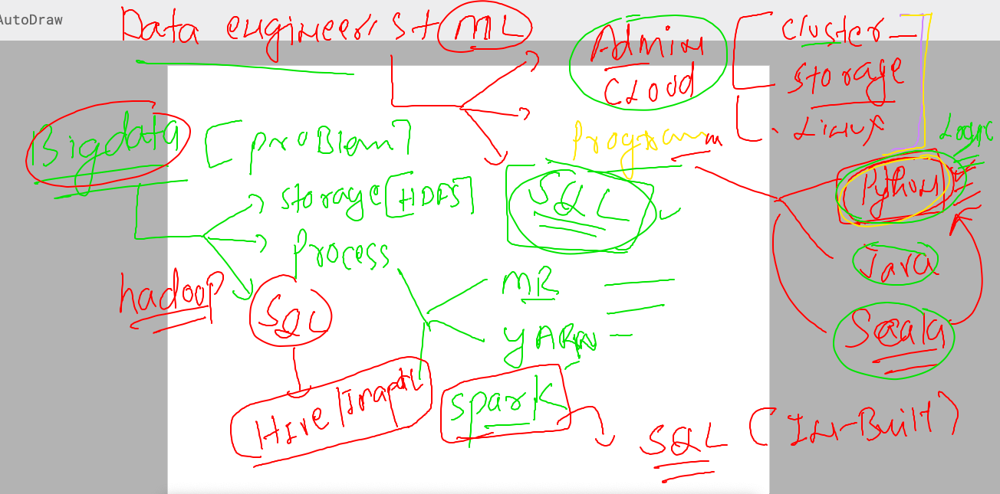
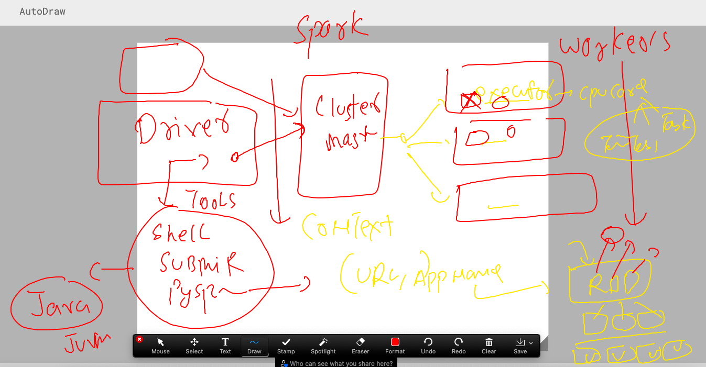

### Revision 

### rev 1 



### Revision 2 



### Revision 3 


### spark streaming getting started 


###  spark stream using python --/ pyspark for word count 

### code 

```
from pyspark import SparkContext
from pyspark.streaming import StreamingContext
# creating spark context 
sc=SparkContext("local","ashu-network-data-wc")
# creating socket stream to recv data in batch interval of 2 seconds 
stream_sc=StreamingContext(sc,50) 
# use stream socket to connect target -- (hostname:port) --/localhost port
my_dataline=stream_sc.socketTextStream("localhost",9876)
# above my_dataline -- is a Dstream -- sequence of rdd 
ashu_word=my_dataline.flatMap(lambda ashu_data: ashu_data.split(" "))
# print it 
ashu_mapper=ashu_word.map(lambda ashumap: (ashumap,1))
# reducing for counting each word
ashu_wc=ashu_mapper.reduceByKey(lambda ashuk,ashuv: ashuk+ashuv)
# printing by collect / pprint 
ashu_wc.pprint()

## start listener socket 
stream_sc.start() # start compute socket 
stream_sc.awaitTermination() # wait for the computation 

```


